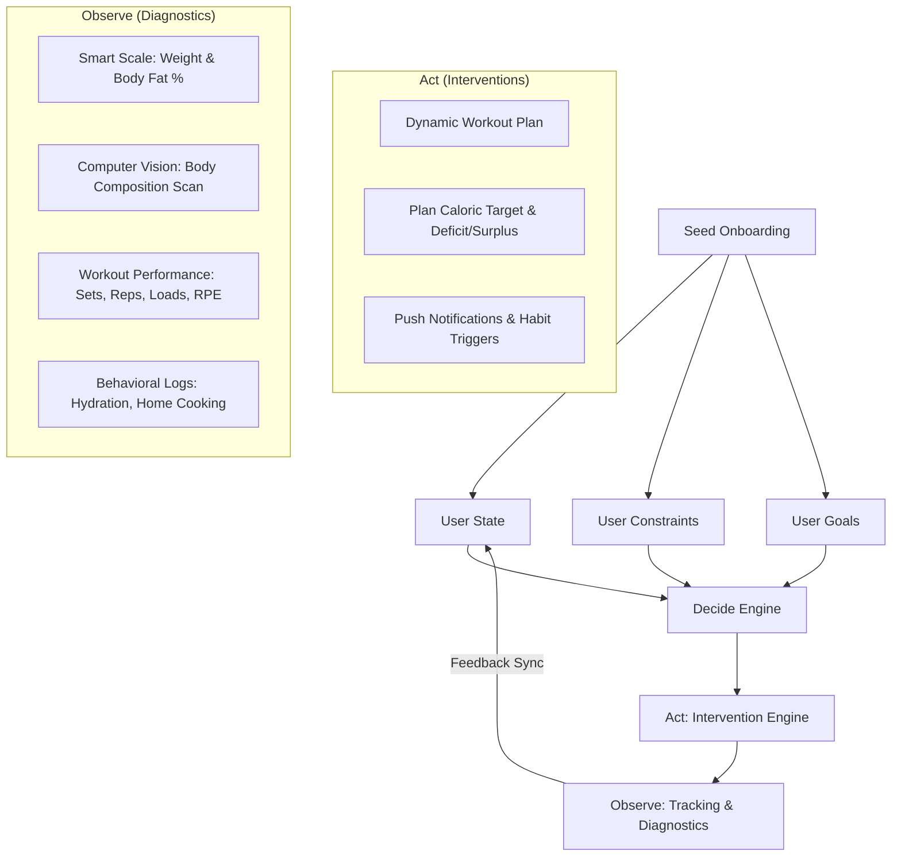

# Fitness & Nutrition Architecture: Goals, States, and Plans

This document defines the AUREVI0N fitness and nutrition ontology, data models, decision engine, workout templates, and the interconnection network between goals, training modalities, caloric states, and meal prep approaches. It is derived from the core system specifications and the onboarding/on-device behavioral blueprints.

---

## 1. Goal Ontologies

AUREVI0N categorizes user objectives into fitness and nutrition domains. Each selection maps to specific caloric adjustments and program selections.

### Fitness Goals
Fitness goals are split into three primary focus areas:

| Category | Goal Key | Display Name | Subtitle / Objective | Default Caloric Impact |
| :--- | :--- | :--- | :--- | :--- |
| **Body Composition** | `hypertrophy` | Hypertrophy | Maximize muscle growth | Build (`+300 kcal` surplus) |
| | `fat_loss` | Fat Loss | Reduce body fat percentage | Lose (`-480 kcal` deficit) |
| | `recomposition` | Recomposition | Build muscle, lose fat | Recomp (`-150 kcal` slight deficit) |
| **Performance** | `max_strength` | Max Strength | Increase 1RM lifts | Build (`+300 kcal` surplus) |
| | `cardio_endurance` | Cardio Endurance | Improve aerobic capacity | Maintain (`0 kcal` net balance) |
| | `power` | Power | Explosive force production | Build (`+300 kcal` surplus) |
| | `agility` | Agility | Speed and coordination | Maintain (`0 kcal` net balance) |
| **Functional Fitness** | `flexibility` | Flexibility | Range of motion and mobility | Maintain (`0 kcal` net balance) |
| | `balance` | Balance | Stability and proprioception | Maintain (`0 kcal` net balance) |
| | `overall_wellness` | Overall Wellness | General health and vitality | Maintain (`0 kcal` net balance) |

### Nutrition Goals
Nutrition goals define behavior modifiers and habit tracking focus areas:

*   **`healthier_meals`**: Focus on food quality, micronutrient density, and unprocessed whole foods.
*   **`cook_more`**: Increase frequency of home-prepared meals (target: $\ge 5$ days/week).
*   **`improve_digestion`**: Focus on dietary fiber, gut-health foods, and identifying trigger intolerances.
*   **`drink_water`**: Daily hydration tracking targeting baseline water intake relative to body mass.
*   **`save_money`**: Optimize meal planning and bulk cooking to reduce grocery spend.

---

## 1b. Goal-to-Training Connection Map

Each fitness goal maps to one or more training modalities with varying strength of connection. This drives program generation in the Decide engine.

### Training Modalities

| Modality Key | Display Name | Description | Rep/Intensity Range | Rest Period |
| :--- | :--- | :--- | :--- | :--- |
| `lifting_hyp` | Hypertrophy Lifting | Volume-focused resistance training | 6-12 reps, RPE 7.5-9 | 60-90s |
| `lifting_str` | Strength Lifting | Heavy compound, neuromuscular focus | 1-5 reps, RPE 8.5-10 | 180-300s |
| `hiit` | HIIT | High-intensity intervals, metabolic conditioning | 6-40s bursts + recovery | 30-60s |
| `zone2_cardio` | Zone 2 Cardio | Aerobic base building, 60-70% max HR | 30-90 min continuous | N/A |
| `circuits` | Circuits | Multi-exercise rounds, minimal rest | 12-20+ reps per station | 0-30s |
| `plyometrics` | Plyometrics | Jump training, explosive movements | 1-5 explosive reps | 60-120s |
| `mobility_yoga` | Mobility / Yoga | Flexibility, recovery, parasympathetic activation | Holds / flows | N/A |
| `calisthenics` | Calisthenics | Bodyweight progressive overload | Varies by progression | 60-120s |

### Goal → Training Modality Matrix

Strength: **S** = strong (primary driver), **M** = moderate (supporting), **W** = weak (supplementary)

| Goal | Hyp Lift | Str Lift | HIIT | Zone 2 | Circuits | Plyo | Mobility | Calisthenics |
| :--- | :---: | :---: | :---: | :---: | :---: | :---: | :---: | :---: |
| Hypertrophy | **S** | | | | | | | M |
| Fat Loss | | M | **S** | M | M | | | |
| Recomposition | **S** | | M | W | | | | |
| Max Strength | | **S** | | | | M | | |
| Cardio Endurance | | | | **S** | M | | | |
| Power | | M | | | | **S** | | |
| Agility | | | | | **S** | M | | |
| Flexibility | | | | | | | **S** | |
| Balance | | | | | | | M | M |
| Wellness | | | | M | W | | M | |

### Goal → Caloric State

| Goal | Primary Caloric State | TDEE Modifier |
| :--- | :--- | :--- |
| Hypertrophy | **Surplus** | +300 kcal |
| Fat Loss | **Deficit** | -480 kcal |
| Recomposition | **Recomp** | -150 kcal |
| Max Strength | Surplus | +300 kcal |
| Cardio Endurance | Maintenance | 0 kcal |
| Power | Surplus | +300 kcal |
| Agility | Maintenance | 0 kcal |
| Flexibility | Maintenance | 0 kcal |
| Balance | Maintenance | 0 kcal |
| Overall Wellness | Maintenance | 0 kcal |

---

## 1c. Body Profile Influence on Goal Suitability

The user's body profile — body fat percentage, BMI, and somatotype tendency — informs which goals are recommended by the Decide engine during onboarding.

### Body Fat Percentage Ranges

| Range (Men) | Range (Women) | Classification | Recommended Primary Goals |
| :--- | :--- | :--- | :--- |
| 2-5% | 10-13% | Essential fat | Maintenance, hypertrophy |
| 6-13% | 14-20% | Athletic | Any — performance or maintenance |
| 14-17% | 21-24% | Fitness | Recomposition, strength, hypertrophy |
| 18-24% | 25-31% | Average | Fat loss, recomposition |
| 25%+ | 32%+ | Overweight | Fat loss, cardio endurance, functional fitness |

### Somatotype Tendencies

These exist on a spectrum, not as fixed categories. All are modifiable through training and nutrition.

**Ectomorph tendency** (lean frame, fast metabolism):
- Difficulty gaining weight/muscle — needs aggressive caloric surplus (+15-20%)
- Best goals: Hypertrophy, strength building
- Training: Heavy, compound-focused, lower volume
- Nutrition: Frequent meals, calorie-dense foods, higher carb ratio

**Mesomorph tendency** (athletic, responsive to training):
- Responds quickly to most stimuli — can succeed with any approach
- Best goals: All equally achievable
- Training: Standard approaches work well
- Nutrition: Moderate flexibility but must track to prevent unwanted fat gain

**Endomorph tendency** (solid build, slower metabolism):
- Tendency toward fat accumulation — focus on metabolic work
- Best goals: Fat loss, recomposition, strength maintenance
- Training: Higher frequency, metabolic conditioning + resistance
- Nutrition: Controlled deficit, protein-heavy, may benefit from lower carbs, carb timing around sessions

---

## 1d. Macro Ratios by Goal

Target macro distribution varies by goal to optimize the specific adaptation:

| Goal | Protein | Carbs | Fat | Protein (g/kg LBM) | Notes |
| :--- | :---: | :---: | :---: | :--- | :--- |
| Hypertrophy | 30-35% | 40-50% | 20-25% | 2.2 | Higher carbs support volume and recovery |
| Fat Loss | 40-45% | 30-40% | 20-25% | 2.4 | Elevated protein for protein-sparing effect |
| Recomposition | 35-40% | 35-45% | 20-25% | 2.2 | Balanced approach |
| Max Strength | 25-30% | 45-50% | 20-25% | 2.0 | Higher carbs for CNS recovery |
| Cardio Endurance | 20-25% | 50-60% | 15-20% | 1.6 | Carb-dominant for sustained fuel |
| Power | 25-30% | 45-50% | 20-25% | 2.0 | Similar to strength |
| Maintenance/Wellness | 25-30% | 40-50% | 25-30% | 1.8 | Balanced, sustainable |

---

## 1e. Caloric State → Meal Prep Pipeline

Each caloric state drives a specific meal prep strategy in the cooking mode:

### Meal Prep Approaches

| Approach Key | Display Name | Description | Cooking Methods |
| :--- | :--- | :--- | :--- |
| `lean_prep` | Lean Prep | High protein, high volume, low calorie | Grill, steam, boil — minimal added fats |
| `bulk_prep` | Bulk Prep | Calorie-dense staples in large batches | Roast, bake, saut&eacute; — oils, nut butters, starches |
| `balanced_prep` | Balanced Prep | Moderate portions, mixed macros, variety focus | All methods — controlled portions |
| `pre_workout` | Pre-Workout Fuel | Carbs + moderate protein, low fat, timed 1-3h before session | Quick cook — toast, rice, oats |
| `post_recovery` | Post-Workout Recovery | Fast protein + carbs within 2h for synthesis + glycogen | Shake, rice bowl, lean protein + starch |

### Caloric State → Meal Prep Matrix

| Caloric State | Primary Prep | Supporting Prep | Timing Focus |
| :--- | :--- | :--- | :--- |
| **Surplus** | Bulk Prep | Pre-workout, Post-recovery | Large portions, frequent meals, calorie density |
| **Deficit** | Lean Prep | Post-recovery | High volume/low cal, strict portions by weight |
| **Maintenance** | Balanced Prep | Pre-workout | Normal variety, controlled portions |
| **Recomp** | Lean Prep + Balanced | Post-recovery | Carb cycling — more carbs on training days |

### Nutrition Goal → Meal Prep Connections

| Nutrition Goal | Connected Prep Approaches | Strength |
| :--- | :--- | :--- |
| Healthier Meals | Balanced Prep, Lean Prep | Strong, Moderate |
| Cook More | All prep approaches | Moderate (breadth over depth) |
| Improve Digestion | Balanced Prep | Moderate |
| Save Money | Bulk Prep, Lean Prep | Strong, Moderate |

### Meal Timing Around Training

| Timing Window | Nutrition Focus | Example Foods |
| :--- | :--- | :--- |
| **Pre-workout** (1-3h before) | Carbs + moderate protein, low fat/fiber | Toast + banana, rice + chicken, oats + protein |
| **Pre-workout** (30-60 min) | Light, fast-digesting carbs | Rice cake, fruit, small shake |
| **Post-workout** (within 2h) | Protein + carbs, faster-digesting | Protein shake + fruit, chicken + white rice |
| **Between sessions** | Protein every 3-4h for optimal synthesis | Balanced meals with protein anchor |
| **Recovery days** | Moderate carbs, adequate protein, higher fats/fiber | Balanced prep, whole food focus |

### Training → Meal Prep Timing Connections

| Training Modality | Pre-Workout Importance | Post-Recovery Importance | Notes |
| :--- | :---: | :---: | :--- |
| Hypertrophy Lifting | Moderate | **Strong** | Post-workout protein critical for MPS |
| Strength Lifting | Moderate | **Strong** | Glycogen replenishment for CNS |
| HIIT | **Strong** | Moderate | Needs glycogen availability for intensity |
| Zone 2 Cardio | Weak | Moderate | Can train fasted; balanced post-session |
| Circuits | Moderate | Moderate | Moderate demands across both |
| Plyometrics | **Strong** | Moderate | High carb pre for explosive output |

---

## 2. Core Data Models

The following schemas outline how AUREVI0N tracks body metrics, user constraints, and target outcomes.

```json
{
  "user_state": {
    "user_id": "string (UUID)",
    "timestamp": "ISO-8601 UTC Timestamp",
    "body": {
      "tdee": "integer (kcal)",
      "weight_kg": "float",
      "lean_mass_kg": "float",
      "fat_mass_kg": "float",
      "body_fat_pct": "float"
    },
    "performance_1rm_kg": {
      "squat": "float",
      "deadlift": "float",
      "bench_press": "float",
      "overhead_press": "float"
    },
    "recovery": {
      "sleep_hours_7d_avg": "float",
      "resting_hr_bpm": "integer",
      "rpe_trend_7d": "float"
    },
    "wearables": {
      "daily_steps_7d_avg": "integer",
      "active_calories_burned": "integer"
    },
    "behavioral": {
      "adherence_rate_30d": "float",
      "protein_hit_ratio_7d": "float",
      "home_cook_7d_count": "integer",
      "water_intake_rate_7d": "float"
    }
  },
  "user_constraints": {
    "dietary": {
      "allergies": ["string"],
      "religious": ["string"],
      "intolerances": ["string"],
      "disliked_foods": ["string"]
    },
    "training": {
      "equipment": "string (full_gym | home_full | home_basic | bands | bodyweight)",
      "available_days": ["Mon", "Tue", "Wed", "Thu", "Fri", "Sat", "Sun"],
      "injuries": ["Knees", "Shoulders", "Lower Back", "Wrists", "Hips"],
      "disliked_exercises": ["string"]
    }
  },
  "user_goal": {
    "domain": "string (fitness | nutrition)",
    "type": "string (goal_key)",
    "target": {
      "metric": "string (weight_kg | body_fat_pct | strength_1rm)",
      "direction": "string (up | down | maintain)",
      "value": "float",
      "unit": "string"
    },
    "time_bound_weeks": "integer",
    "depends_on_goal_id": "string | null",
    "status": "string (active | paused | completed)",
    "created_at": "ISO-8601 UTC Timestamp",
    "updated_at": "ISO-8601 UTC Timestamp"
  }
}
```

---

## 3. The Decide-Act-Observe Loop

AUREVI0N operates on a closed-loop cybernetic feedback system to dynamically adjust workout loads and nutritional advice.



1.  **Decide**: The `Decide(State, Goals, Constraints)` algorithm processes biometrics, active goals, and mechanical constraints (e.g. knee injury, home gym only) to generate a customized macro target and training progression.
2.  **Act**: The application delivers personalized training schedules, cooking timeline instructions, and behavioral nudges.
3.  **Observe**: Passive (wearables, scales) and active (workout tracking, food logs, body composition computer vision scans) inputs update the `user_state`.
4.  **Loop**: When the observed metrics shift (e.g. TDEE updates or recovery dips), the Decide engine recalculates targets.

---

## 4. Workout Plan Templates by Goal

Below are the canonical 8-to-12 week program templates based on user goals. These templates automatically adapt to the user's available equipment and injuries.

### A. Body Composition Focus

#### 1. Hypertrophy Plan (Muscle Building)
*   **Primary Objective**: Stimulate muscular hypertrophy via progressive volume.
*   **Caloric Protocol**: `Build` (+300 kcal above TDEE), Protein target of $2.2g/kg$ lean mass.
*   **Frequency**: 4–5 days/week (defaulting to Upper/Lower or Push/Pull/Legs).
*   **Rep Range**: 8–12 reps at RPE 7.5–9.
*   **Adaptation Path**:
    *   *No Gym/Home Basic*: Swap barbells for dumbbell equivalents or high-intensity bodyweight variations (e.g. Pistol Squats, Deficit Push-ups).
    *   *Knee/Lower Back Injury*: Swap Back Squats for Leg Press, Bulgarian Split Squats, or Romanian Deadlifts with light loads/cables.

##### Sample Hypertrophy Session (Upper Focus)
| Exercise | Sets x Reps | Rest | Focus & Progression | Injury Alt |
| :--- | :--- | :--- | :--- | :--- |
| **Incline DB Bench Press** | 4 × 8–10 | 120s | Primary chest driver; progress weight | Shoulder injury $\rightarrow$ DB Floor Press |
| **Chest-Supported Row** | 4 × 10 | 90s | Upper back density; keep spine neutral | Lower Back $\rightarrow$ Lat Pulldown |
| **Overhead Press (DB)** | 3 × 10 | 90s | Shoulder hypertrophy; control eccentric | Shoulder $\rightarrow$ Lateral Raises |
| **Incline DB Curls** | 3 × 12 | 60s | Biceps long head stretch | Wrist $\rightarrow$ Hammer Curls |
| **Triceps Overhead Extension**| 3 × 12 | 60s | Triceps long head stimulus | Elbow $\rightarrow$ Cable Pushdowns |

---

#### 2. Fat Loss Plan
*   **Primary Objective**: Preserve lean tissue while maximizing caloric expenditure and metabolic rate.
*   **Caloric Protocol**: `Lose` (-480 kcal below TDEE), Protein target of $2.4g/kg$ lean mass (elevated for protein-sparing effect).
*   **Frequency**: 3–4 days/week (Full-Body focus).
*   **Rep Range**: 6–10 reps for compound strength, plus supersets for density.
*   **Adaptation Path**:
    *   *Wrist Injury*: Avoid front squats or heavy barbell curls; swap to DB goblet squats holding the bell vertically.

##### Sample Fat Loss Session (Full-Body Density)
| Exercise | Sets x Reps | Rest | Focus & Progression | Injury Alt |
| :--- | :--- | :--- | :--- | :--- |
| **Trap Bar Deadlift** | 4 × 6 | 150s | Posterior chain strength; preserves spine | Lower Back $\rightarrow$ DB Goblet Box Squat |
| **A1: DB Flat Bench Press** | 3 × 8 | 0s | Super-set pair; upper body push | Shoulder $\rightarrow$ Cable Crossover |
| **A2: Lat Pulldown (Neutral Grip)**| 3 × 10 | 90s | Super-set pair; upper body pull | Shoulder $\rightarrow$ Single-arm DB Row |
| **B1: Walking Lunges** | 3 × 12/leg| 0s | Super-set pair; unilateral fatigue | Knee $\rightarrow$ Glute Bridges |
| **B2: Hanging Knee Raises** | 3 × Max | 60s | Core stabilization and recovery | Lower Back $\rightarrow$ Deadbug |

---

#### 3. Recomposition Plan
*   **Primary Objective**: Build muscle and burn fat simultaneously (ideal for beginners and detrained individuals).
*   **Caloric Protocol**: `Recomp` (-150 kcal below TDEE), high protein ($2.2g/kg$).
*   **Frequency**: 4 days/week (Upper/Lower Split).
*   **Rep Range**: Wave periodization (Heavy 5-6 rep compound sets followed by accessory 10-12 rep sets).

---

### B. Performance Focus

#### 1. Max Strength Plan
*   **Primary Objective**: Increase neuromuscular adaptation and maximum force output in compound lifts.
*   **Caloric Protocol**: `Build` (+300 kcal above TDEE) or `Maintain`.
*   **Frequency**: 3–4 days/week (focused on Squat, Bench, Deadlift, Overhead Press).
*   **Rep Range**: 1–5 reps at RPE 8.5–10, 3–5 min rest intervals.

##### Sample Max Strength Session (Lower/Squat Day)
| Exercise | Sets x Reps | Rest | Focus & Progression | Injury Alt |
| :--- | :--- | :--- | :--- | :--- |
| **Back Squat** | 5 × 3 @ 85% 1RM| 180s-240s| Primary strength driver; progressive load | Knee/Back $\rightarrow$ Leg Press 3 x 8 |
| **Romanian Deadlift** | 3 × 6 | 120s | Hamstring/glute hypertrophy | Lower Back $\rightarrow$ Hamstring Curl |
| **Bulgarian Split Squat** | 3 × 8/leg | 90s | Unilateral quad/hip stability | Knee $\rightarrow$ Single-leg Leg Press |
| **Ab Wheel Rollout** | 3 × 8 | 60s | Anti-extension core strength | Lower Back $\rightarrow$ Plank |

---

#### 2. Cardio Endurance Plan
*   **Primary Objective**: Improve aerobic capacity ($VO_2$ max) and cellular mitochondrial efficiency.
*   **Caloric Protocol**: `Maintain` (TDEE plus added output tracking).
*   **Frequency**: 3–5 days/week (focused on Zone 2 running/cycling, with 1 HIIT session).
*   **Heart Rate Protocol**: Zone 2 (60-70% Max Heart Rate) for 80% of volume; Zone 5 (HIIT) for 20% of volume.

---

#### 3. Power & Agility Plan
*   **Primary Objective**: Enhance rate of force development (RFD), explosive power, and dynamic directional shifts.
*   **Caloric Protocol**: `Maintain`.
*   **Frequency**: 3 days/week.
*   **Rep Range**: 1–5 explosive reps (Plyometrics, Olympic lift variations, sprint drills).

---

### C. Functional & Wellness Focus

#### 1. Flexibility & Balance Plan
*   **Primary Objective**: Increase active range of motion, joint lubrication, and spatial proprioception.
*   **Caloric Protocol**: `Maintain`.
*   **Frequency**: 5–7 days/week (15–20 min daily mobility and stability drill routine).

##### Sample Daily Mobility & Balance Routine
| Phase | Movement | Time/Reps | Objective |
| :--- | :--- | :--- | :--- |
| **Decompression** | Cat-Cow | 10 slow reps | Mobilize thoracic and lumbar spine |
| **Hip Mobility** | 90/90 Hip Swivels | 10 reps/side | Open internal/external rotation |
| **Shoulder Mobility**| Kettlebell Halos | 8 reps/direction| Lubricate rotator cuffs |
| **Balance** | Single-Leg Stand | 60s/leg | Proprioception & ankle stabilizers |
| **Release** | Deep Squat Hold | 90s | Open hips and stretch posterior chain |

---

## 5. Constraint Adaptation Matrix

When an injury or equipment limitation is selected, the **Decide** engine automatically filters and overrides the workout template:

```yaml
InjuryOverrides:
  Knees:
    Exclusions: ["Back Squat", "Front Squat", "Leg Extensions", "Walking Lunges"]
    Inclusions: ["Glute Bridges", "Romanian Deadlifts", "Leg Press (High Foot Placement)", "Box Squats"]
  Lower Back:
    Exclusions: ["Barbell Deadlift", "Barbell Row", "Overhead Press (Standing)"]
    Inclusions: ["Chest-Supported DB Rows", "Glute Ham Raises", "Belt Squats", "DB Bench Press"]
  Shoulders:
    Exclusions: ["Barbell Bench Press", "Standing Overhead Press", "Barbell Incline Press"]
    Inclusions: ["Neutral Grip DB Bench Press", "Landmine Press", "Push-ups", "Face Pulls"]

EquipmentOverrides:
  Bodyweight Only:
    Squat_Alt: "Pistol Squats or Tempo Air Squats"
    Bench_Alt: "Deficit Push-ups or Dips"
    Deadlift_Alt: "Single-Leg RDL (Unweighted) or Nordic Curls"
    Row_Alt: "Inverted Bodyweight Rows (using table/bar)"
  Bands:
    Squat_Alt: "Banded Goblet Squats"
    Bench_Alt: "Banded Floor Press"
    Deadlift_Alt: "Banded Good Mornings"
    Row_Alt: "Banded Seated Rows"
```

---

## 6. Goal Network — Interactive Graph

All of the connections documented above (goals, training modalities, caloric states, meal prep approaches, nutrition goals) are visualized as an interactive graph at `/journey/goals` in the app.

The graph uses a concentric ring layout:
- **Outer ring**: Fitness goals (upper arc) + Nutrition goals (lower arc)
- **Middle ring**: Training modalities (upper arc) + Meal prep approaches (lower arc)
- **Inner ring**: Caloric states (surplus, deficit, maintenance, recomp)

**32 nodes** across 5 categories connected by **65 edges** of varying strength (strong, moderate, weak). Click any node to highlight its connections and see a detail panel with edge metadata.

Source data: `src/tools/goal-network/goal-network-data.js`

### The Full Pipeline

```
User Profile (body fat %, somatotype, activity level)
    ↓ informs
Goal Selection (hypertrophy, fat loss, recomp, etc.)
    ↓ drives
Training Modality (lifting, HIIT, zone 2, circuits, etc.)
    ↓ determines                    ↓ determines
Caloric State (surplus/deficit)     Meal Timing (pre/post workout)
    ↓ shapes                        ↓ shapes
Meal Prep Approach (lean/bulk/balanced)
    ↓ feeds into
Cooking Mode (batch prep, parallel timeline, active cook)
    ↓ observed by
Check-in Loop (weight, body fat, adherence, performance)
    ↓ adjusts
Goal / Training / Nutrition (feedback loop)
```

This pipeline is the bridge between fitness mode and cooking mode — the user's goals directly determine what they train and what they cook.
