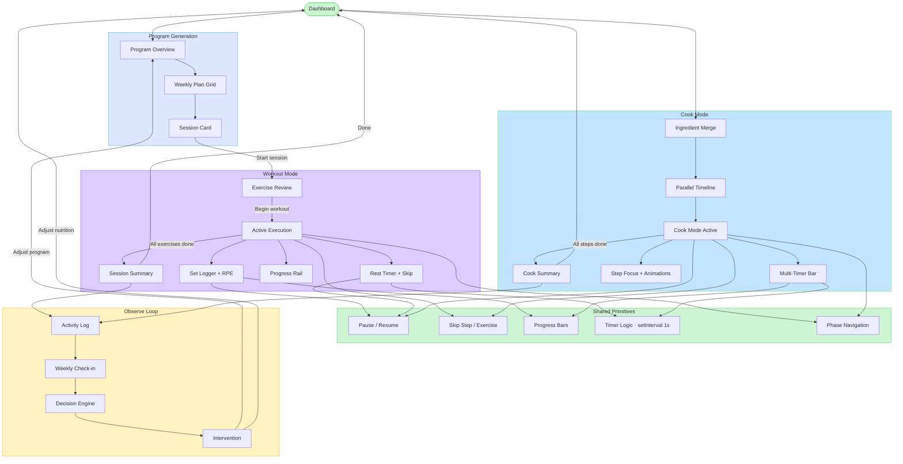

# Focused Mode — User Journey

Workout Mode and Cook Mode share a unified focused-mode system. Both follow the same structural pattern: preview → active execution with timers → summary.

## Flow



## Legend

| Color | Meaning |
|-------|---------|
| Light blue | Program Generation — goal-driven plan output |
| Purple | Workout Mode — 3-phase active session |
| Blue-green | Cook Mode — 3-screen prep and execution |
| Green | Shared primitives — timer, pause, progress |
| Yellow | Observe loop — logging, check-in, intervention |

---

## Workout Mode (Current Implementation)

### Phase 1: Program Overview
**File**: `src/app/screens/ProgramOverview.jsx`
**Entry**: Train tab (default) or Session tile tap

- Weekly plan grid showing all 7 days
- Each session card: name, modality tag (Hypertrophy/Strength/HIIT/etc.), exercise count, duration estimate
- Exercise preview (first 3 exercises with sets/reps/load)
- "Start session" button on each card
- Rest days shown as minimal recovery rows
- Stats footer: sessions/week, rest days, split label
- Auto-generated from `UserContext.workoutPlan` via `generateProgram()`

### Phase 2: Active Session
**File**: `src/app/screens/Training.jsx`
**Entry**: "Start session" pushes detail with session data

Three internal phases:

**Review** — Exercise list with sets/reps/load and form cues. "Begin Workout" button.

**Execute** — The core workout experience:
- Progress rail (segmented bar, done/active/remaining)
- Elapsed timer (global, ticks every second via `setInterval`)
- Current exercise focus card (name, muscles, form cue)
- Set tracker (visual cards per set with checkmark/accent/empty states)
- RPE selector (buttons 5-10, tap before logging)
- "Log set" button (records reps + weight + RPE, advances set)
- Rest timer (countdown from exercise's rest period, skip button)
- Auto-advance to next exercise when all sets logged
- Bottom toolbar: Pause/Resume, Skip Exercise, End Workout

**Summary** — Auto-computed from logged data:
- Hero green checkmark + duration
- Volume (Σ reps × load), total sets, avg RPE
- Exercise breakdown with per-exercise volume
- "Done" button → pops detail, marks session complete

### State
```js
phase: 'review' | 'execute' | 'summary'
currentExIdx, currentSetIdx    // exercise and set position
loggedSets: [{                 // per-exercise log
  exerciseId, name,
  planned: { sets, reps, load },
  logged: [{ reps, load, rpe }]
}]
elapsed: number                // seconds since workout start
restRem: number                // rest countdown (seconds)
paused: boolean                // pause flag
rpeInput: number | null        // current RPE selection
resting: boolean               // in rest period
```

---

## Cook Mode (Current Implementation)

### Screen 5A: Ingredient Merge
**File**: `src/app/screens/MealPrep.jsx` (MealPrepMergeContent)

- 3+ recipes merged into single ingredient list
- Ingredient deduplication across recipes
- Checkbox to mark prepped items
- Color-coded recipe attribution ("salmon 2 · chili 2")
- "Check pantry" link to Fridge screen

### Screen 5B: Parallel Timeline
**File**: `src/app/screens/MealPrep.jsx` (MealPrepTimelineContent)

- Gantt-style lanes (one per recipe)
- Time ruler (0–78 min)
- NOW cursor with elapsed time
- Step state: done (dashed border) / active (solid fill) / todo (full opacity)
- Active passive steps: striped pattern overlay
- Active timers list sorted by remaining time
- Pause/resume for all timers

### Screen 5C: Active Cook Mode
**File**: `src/app/screens/MealPrep.jsx` (MealPrepCookModeContent)

- 3 independent countdown timers (per recipe)
- Step focus card with contextual animation (26 animations: sear, steam, chop, plate, etc.)
- Step navigation (back/forward)
- Conflict detection: red alert when oven temperatures overlap
- Pause/resume for all timers simultaneously

### State
```js
step: number           // 1-indexed current step
timers: [{             // per-recipe timer
  color, label,
  total: seconds,
  rem: seconds,        // remaining (decremented every 1s)
  big?: boolean
}]
paused: boolean
done: Set<number>      // checked ingredients (merge view)
elapsedSec: number     // timeline elapsed (timeline view)
```

---

## Shared Primitives

### Timer Pattern
Both modes use the same `setInterval` approach:
```js
useEffect(() => {
  if (paused) return
  const t = setInterval(() => {
    setElapsed(s => s + 1)
    setRestRem(s => Math.max(0, s - 1))  // or setTimers for cook mode
  }, 1000)
  return () => clearInterval(t)
}, [paused])
```

### Progress Display
- `FTexBar` for horizontal progress
- Segmented bar for exercise progression (done/active/remaining)
- `FNum` for elapsed time display
- `formatTime(sec)` → "MM:SS"

### Controls
- Pause/Resume toggle (`FBtn variant="ghost"`)
- Skip (exercise or step) (`FBtn variant="ghost"`)
- End session (`FBtn variant="split"`)

### Layout Structure
```
Sticky header    — flexShrink: 0, borderBottom
Main content     — flex: 1, overflowY: auto, minHeight: 0
Bottom toolbar   — flexShrink: 0, borderTop (workout) or padding (cook)
```

---

## Observe Loop (Post-Session)

Both modes write to `UserContext.activityLog` on completion:

```js
// Workout
logWorkout({ duration, type, name, loggedSets })

// Cook
logCook({ duration, recipes, portions })
```

This feeds into:
- **Behavioral metrics**: `workouts_7d`, `home_cook_7d` (7-day rolling window)
- **Weekly check-in**: Decision engine evaluates adherence + body metrics
- **Interventions**: Generated if thresholds crossed (e.g., too-aggressive weight loss)

---

## Remaining Gaps

| Gap | Impact | Notes |
|-----|--------|-------|
| **Session persistence** | High | Active state is `useState` — lost on navigation or app close |
| **Abandon recovery** | High | No way to resume a dropped workout or cook session |
| **Audio/haptic cues** | Medium | No sound on rest timer completion or cook timer done |
| **Exercise substitution** | Medium | Can't swap exercises during a session |
| **Recipe ↔ Macro connection** | High | Cook mode recipes are hardcoded, not generated from targets |
| **PR tracking** | Medium | Summary computes volume but doesn't persist bests |
| **Periodization** | High | Programs are static — no week-to-week progression |
| **Cook ↔ Food log** | Medium | Completing cook mode doesn't auto-log meals |
